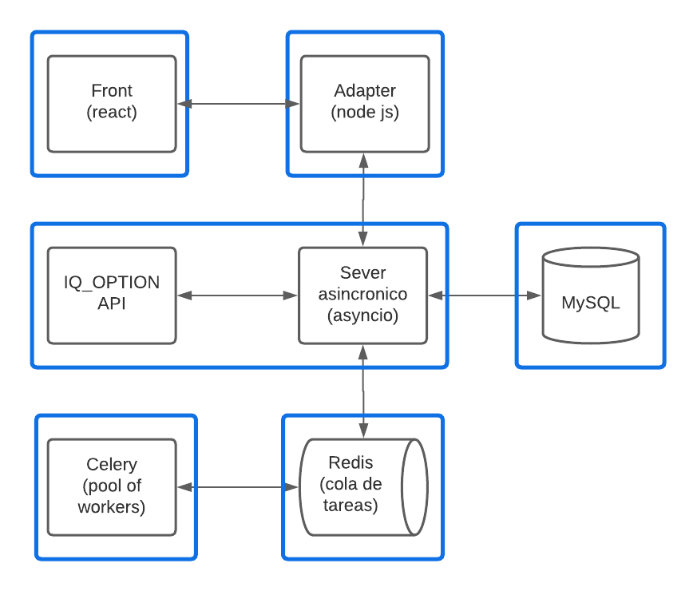

# FINAL

La aplicacion se basa en un servidor concurrente asincronico que recibe datos de la api de IQ_OPTION, analiza los datos y segun diferentes parametros que el usuario establece compra a la baja o a la alza. Los datos de las operaciones se guardan en una base de datos MySQL.

Se utiliza un pool of workers con celery para analizar un mercado, y operarlo en caso de que se den los patrones preestablecidos para operar, la aplicacion puede estar analizando horas hasta que los graficos muestren un patron donde la probabilidad de beneficio sea alta.

La aplicacion al analizar un mercado solicita informacion en tiempo real de las velas (graficos) a la api de IQ_OPTION, la api del broker devuelve en forma de JSON la informacion de una o mas velas. La aplicacion utilizando la libreria pandas analiza los datos y si los datos conciden con los parametros establecidos por el usuario la aplicacion opera.

Cuando se realiza una operacion la misma y su resultado se guardan en la base de datos.

Al instante que se realiza una operacion se guarda en la base de datos y se envia mediante sockets al front en tiempo real (operacion pendiente), una vez la operacion termina se actualiza su estado y resultado en la base de datos y se vuelve a enviar al front en tiempo real para ver la operacion completa (operacion terminada).

Tambien cada vez que se abre una nueva vela se notifica mediante sockets al front para que el usuario pueda ver que esta pasando.

La aplicacion tiene sockets para el envio de datos al front en tiempo real, celery para hacer el procesamiento de los datos utilizando un pool of workers, un front hecho con react, tambien utilizamos el modulo asyncio para manejar todas las tareas del backend con concurrencia.

# Front:

- Contiene el inicio de sesion
- Muestra los mercados listos para operar y muestra el mercado que se esta operando
- Muestra las operaciones abiertas en tiempo real y el estado de la grafica en tiempo real
- Muestra todas las operaciones guardadas en la base de datos

# BD:

- Los datos de las operaciones (monto, fecha, si se gano o perdio)
- Tablas:

    
    | id | fecha | resultado | monto operado | mercado | beneficio | duracion | estado | mensaje | tipo |
    | --- | --- | --- | --- | --- | --- | --- | --- | --- | --- |

# API:

- Extraer datos de la api de iqoption, los analiza se fija si compra o vende en un x mercado, entrega los datos al front y guarda datos en la BD, se comunica con celery a traves de redis para calcular cuando operar

# Pool of workers:

- Analiza un mercado en tiempo real y envia señales para operar
